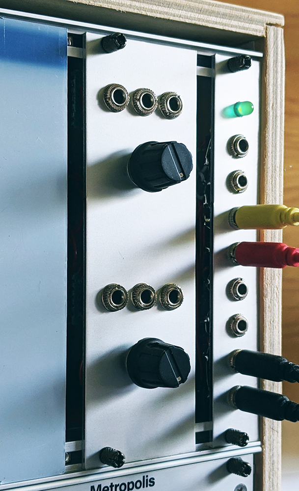

# VCAs
A high-performance dual voltage-controlled amplifier module for Eurorack, adapted from Émilie Gillet's open-source quad-VCA designs for Mutable Instruments' 'Veils'.

Features:
* Two independent low-noise voltage-controlled amplifiers with fixed exponential response.
* Gain variable between -∞ and 10, controlled via 0V to 10V internal or external control voltage.

[Circuit schematic for this project](schematic/Dual_VCA_Schematic.pdf)
